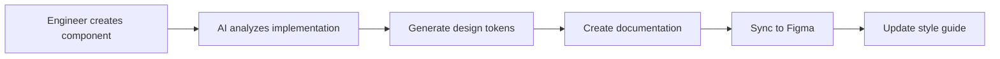
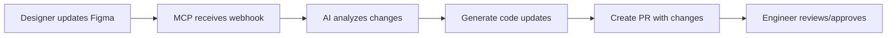

# AI-Powered Design System Generator Specification

## Executive Summary

This specification outlines the architecture and implementation of an innovative AI-powered design system generator that bridges the gap between design and engineering workflows. The system's primary focus is enabling engineers to generate comprehensive design system documentation as they build, creating a truly unified design-to-code workflow delivered through Model Context Protocol (MCP) servers. [^emkvx2] [^chi5g7]


## Vision & Goals

### Primary Objectives
- **Engineer-First Documentation**: Enable engineers to generate design system documentation directly from their code implementations[^67aeae] [^wdm323]
- **Bidirectional Synchronization**: Maintain real-time sync between design tools and code repositories[^urqh0r] [^nd2bbt]
- **AI-Powered Automation**: Leverage LLMs to translate between design specifications and implementable components[^obbkg0] [^2wmeyb]
- **Unified Workflow**: Create a seamless bridge between UI design and engineering processes[^rcg3af]

### Key Differentiators
- Documentation generation happens **during** development, not after
- Engineers become active contributors to design system documentation
- AI assists in maintaining consistency across design and code[^3iskas] [^2wmeyb]


# Component Display Component Specification

## Overview
A reusable component for displaying and documenting UI components in a design system. This component provides a clean, interactive way to showcase components with code examples, variants, and usage guidelines.

## Features

### 1. Component Preview
- Displays the rendered component in an isolated container
- Responsive preview area with viewport size controls
- Toggle between light/dark mode
- Background color customization
- Toggle component states/interactions

### 2. Code Display
- Syntax-highlighted code examples
- Toggle between different frameworks (React, Vue, Svelte, etc.)
- Copy to clipboard functionality
- Expandable/collapsible code blocks

### 3. Component Controls
- Interactive prop controls (sliders, toggles, selects)
- Live preview updates as props change
- Preset configurations
- Reset to defaults option

### 4. Documentation
- Component name and description
- Status badges (New, Deprecated, Experimental)
- Version information
- Last updated timestamp
- Dependencies

## Props

| Prop | Type | Default | Description |
|------|------|---------|-------------|
| `title` | string | '' | The name of the component |
| `description` | string | '' | Brief description of the component |
| `component` | React/Vue/Svelte Component | - | The actual component to display |
| `variants` | Array<{name: string, props: object}> | [] | Different variants of the component |
| `code` | string | '' | Example code for the component |
| `status` | 'stable' \| 'beta' \| 'deprecated' | 'stable' | Component status |
| `version` | string | '1.0.0' | Component version |
| `dependencies` | string[] | [] | List of dependencies |

## Usage Example

```jsx
<ComponentDisplay
  title="Button"
  description="A simple button component with multiple variants and sizes."
  component={Button}
  variants={[
    { name: 'Primary', props: { variant: 'primary', children: 'Click Me' } },
    { name: 'Secondary', props: { variant: 'secondary', children: 'Click Me' } },
  ]}
  code={`<Button variant="primary">Click Me</Button>`}
  status="stable"
  version="1.2.0"
  dependencies={['@your-design-system/core']}
/>
```

## Accessibility
- Keyboard navigation support
- Screen reader friendly
- Proper ARIA attributes
- Focus management

## Responsive Behavior
- Adapts to different screen sizes
- Mobile-friendly controls
- Horizontal scrolling for wide components
- Toggleable device frames

## Theme Support
- Light/dark mode
- Custom theming
- Contrast ratio checking
- Color blindness simulation

## Development Guidelines
1. Use TypeScript for type safety
2. Follow WCAG 2.1 AA standards
3. Document all props and methods
4. Include unit tests
5. Add storybook stories
6. Support SSR/SSG

## Future Enhancements
- Interactive playground
- Visual regression testing
- Performance metrics
- Bundle size analysis
- Automated screenshot testing

## System Architecture

### Core Components

#### 1. MCP Server Architecture
The system implements a multi-server MCP architecture[^japg2p] [12]:

```
┌─────────────────────────────────────────────────┐
│                  MCP Host                       │
│         (IDE/Development Environment)           │
├─────────────────────────────────────────────────┤
│  MCP Client 1    │  MCP Client 2   │ MCP Client 3│
└──────┬───────────┴──────┬──────────┴─────┬──────┘
       │                  │                 │
       ▼                  ▼                 ▼
┌──────────────┐  ┌──────────────┐  ┌──────────────┐
│Design System │  │Documentation │  │   AI Agent   │
│   Server     │  │    Server    │  │    Server    │
└──────────────┘  └──────────────┘  └──────────────┘
```

#### 2. AI Orchestration Framework
Built on LangChain/LangGraph for sophisticated agent workflows[^fc33aj] [^5m26pl] [15]:

- **Multi-Agent Architecture**: Specialized agents for different tasks (design analysis, code generation, documentation writing)
- **Context Engineering**: Full control over prompts and agent interactions[^j9qfej]
- **Human-in-the-Loop**: Approval workflows for critical changes[^b1gp81]

### Technical Stack

#### Backend Infrastructure
- **Runtime**: Node.js/TypeScript for MCP server implementation[^4655sr]
- **AI Framework**: LangChain/LangGraph for orchestration[^fc33aj] [^0pdc5h] [^b1gp81]
- **API Layer**: GraphQL with real-time subscriptions[^0m4vgj]
- **Database**: PostgreSQL with vector extensions for semantic search
- **Message Queue**: Redis for inter-service communication

#### Frontend Tools
- **Design Integration**: Figma API for design token extraction[^xjts7a] [^afj9nm]
- **Documentation Engine**: MDX-based system with live component rendering[^u4os0c]
- **Code Generation**: Style Dictionary for multi-platform token transformation[^afj9nm] [^a6fbdo]

#### AI/ML Components
- **LLMs**: Support for multiple providers (OpenAI, Anthropic, local models)
- **Embeddings**: Vector database for semantic component search
- **Fine-tuning**: Custom models for organization-specific patterns

## Key Features

### 1. Automated Design Token Management
The system automatically extracts and manages design tokens[^7qig1h] [25]:

```typescript
interface TokenWorkflow {
  extract: {
    source: 'Figma' | 'Code' | 'Documentation';
    format: 'Variables' | 'Styles' | 'Components';
  };
  transform: {
    target: 'CSS' | 'Swift' | 'Android' | 'React';
    method: 'StyleDictionary' | 'Custom';
  };
  sync: {
    direction: 'Bidirectional' | 'DesignToCode' | 'CodeToDesign';
    trigger: 'Realtime' | 'Commit' | 'Manual';
  };
}
```

### 2. Engineer-Driven Documentation Generation

Engineers can generate documentation through:

#### Code Comments & Annotations
```typescript
/**
 * @designToken primary-button
 * @category buttons
 * @status stable
 * @accessibility WCAG AA compliant
 */
export const PrimaryButton = styled.button`
  background: var(--color-primary);
  // AI automatically generates usage docs from implementation
`;
```

#### MCP Commands
```bash
# Generate component documentation
mcp generate-docs --component PrimaryButton

# Update design system from code changes
mcp sync-tokens --source code --target figma
```

### 3. Real-Time Design-Code Synchronization
Implements bidirectional sync using[^urqh0r] [6]:
- **Figma Webhooks**: Instant updates when designs change
- **Git Hooks**: Automatic documentation updates on commits
- **WebSocket Connections**: Live preview during development

### 4. AI-Powered Component Translation

The AI agent can[^obbkg0] [^3jh7m9] [8]:
- Convert Figma components to framework-specific code
- Generate responsive variations automatically
- Create accessibility-compliant implementations
- Suggest design token optimizations

## MCP Server Implementation

### Server Types

#### 1. Design System Server
Handles design token management and component registry:

```typescript
interface DesignSystemServer {
  resources: {
    '/tokens': TokenResource;
    '/components': ComponentResource;
    '/themes': ThemeResource;
  };
  tools: {
    'extract-tokens': ExtractTokensTool;
    'validate-tokens': ValidateTokensTool;
    'generate-theme': GenerateThemeTool;
  };
  prompts: {
    'component-spec': ComponentSpecPrompt;
    'token-naming': TokenNamingPrompt;
  };
}
```

#### 2. Documentation Server
Manages documentation generation and updates[^67aeae] [27]:

```typescript
interface DocumentationServer {
  tools: {
    'generate-docs': GenerateDocsTool;
    'update-docs': UpdateDocsTool;
    'validate-docs': ValidateDocsTool;
  };
  resources: {
    '/templates': DocTemplateResource;
    '/examples': CodeExampleResource;
  };
}
```

#### 3. AI Agent Server
Orchestrates LLM interactions[^5m26pl] [16]:

```typescript
interface AIAgentServer {
  tools: {
    'analyze-design': AnalyzeDesignTool;
    'generate-code': GenerateCodeTool;
    'suggest-improvements': SuggestImprovementsTool;
  };
  prompts: {
    'design-to-code': DesignToCodePrompt;
    'code-review': CodeReviewPrompt;
  };
}
```

## Workflow Examples

### 1. Component Creation Workflow


### 2. Design Update Workflow


## Security & Governance

### Access Control
- **Role-based permissions** for design system modifications
- **Audit trails** for all automated changes
- **Approval workflows** for breaking changes

### Data Security
- **End-to-end encryption** for design assets
- **Secure token storage** with environment-specific access
- **GDPR-compliant** data handling

## Performance Considerations

### Scalability
- **Microservice architecture** for independent scaling[^japg2p]
- **Caching layers** for frequently accessed tokens[^0m4vgj]
- **CDN distribution** for generated assets

### Optimization
- **Incremental updates** to minimize processing
- **Batch operations** for bulk changes
- **Lazy loading** for documentation sites

## Integration Points

### Development Tools
- **VS Code Extension**: Direct IDE integration[^emkvx2] [^rcg3af]
- **CI/CD Pipelines**: Automated validation and deployment[^5ap3yg]
- **Git Workflows**: Branch-specific design systems

### Design Tools
- **Figma Plugin**: Two-way sync capabilities[^xjts7a] [^rcg3af]
- **Sketch Integration**: Token import/export
- **Adobe XD Support**: Component mapping

### Documentation Platforms
- **Storybook Integration**: Auto-generated stories[^u4os0c]
- **ZeroHeight Sync**: Documentation updates[^u4os0c]
- **Custom Portals**: API-driven content

## Success Metrics

### Quantitative Metrics
- **50% reduction** in design-to-code time[^urqh0r]
- **90% consistency** in component implementations
- **75% reduction** in documentation maintenance effort

### Qualitative Metrics
- Improved designer-developer collaboration
- Higher design system adoption rates
- Better component reusability

## Implementation Roadmap

### Phase 1: Foundation (Months 1-3)
- Core MCP server architecture
- Basic token extraction and sync
- MVP documentation generation

### Phase 2: AI Integration (Months 4-6)
- LangChain integration
- Component translation capabilities
- Automated documentation writing

### Phase 3: Advanced Features (Months 7-9)
- Multi-framework support
- Advanced AI suggestions
- Performance optimizations

### Phase 4: Enterprise Features (Months 10-12)
- Advanced governance tools
- Analytics and insights
- Custom AI model training

## Conclusion

This AI-powered design system generator represents a paradigm shift in how teams approach design system documentation and maintenance. By placing engineers at the center of the documentation process and leveraging AI to bridge the design-code gap, we can create more consistent, maintainable, and scalable design systems. [^obbkg0] [^67aeae] [^rcg3af]

The MCP server architecture provides the flexibility and extensibility needed to integrate with existing tools while the AI orchestration layer ensures intelligent automation that enhances rather than replaces human creativity and decision-making. [^emkvx2] [^b1gp81] [^j9qfej]

# Sources

[^emkvx2]: [Introducing the Model Context Protocol - Anthropic](https://www.anthropic.com/news/model-context-protocol)
[^chi5g7]: [Model Context Protocol - Wikipedia](https://en.wikipedia.org/wiki/Model_Context_Protocol)
[^67aeae]: [Design System Documentation in 9 Easy Steps - UXPin](https://www.uxpin.com/studio/blog/design-system-documentation-guide/)
[^wdm323]: [Engineering Documentation 101: Essential Tips and Best Practices](https://slite.com/en/learn/engineering-documentation)
[^urqh0r]: [How Real-Time Code Preview Improves Design-to-Code Workflows](https://www.uxpin.com/studio/blog/how-real-time-code-preview-improves-design-to-code-workflows/)
[^nd2bbt]: [Real-Time Collaboration: Syncing Figma Designs with Live Front ...](https://blog.openreplay.com/syncing-figma-designs-with-front-end-code/)
[^obbkg0]: [AI Design System – Are We There? - UXPin](https://www.uxpin.com/studio/blog/ai-design-system/)
[^2wmeyb]: [AI and Design Systems | Brad Frost](https://bradfrost.com/blog/post/ai-and-design-systems/)
[^rcg3af]: [Design Systems And AI: Why MCP Servers Are The Unlock - Figma](https://www.figma.com/blog/design-systems-ai-mcp/)
[^3iskas]: [How AI Automates Design Tokens in the Cloud - UXPin](https://www.uxpin.com/studio/blog/how-ai-automates-design-tokens-in-the-cloud/)
[^japg2p]: [How MCP servers work: Components, logic, and architecture](https://workos.com/blog/how-mcp-servers-work)
[^uhoer3]: [Core architecture - Model Context Protocol （MCP）](https://modelcontextprotocol.info/docs/concepts/architecture/)
[^fc33aj]: [AI-orchestration Langchain - Vertel AB](https://vertel.se/en/ai-orchestration-langchain)
[^5m26pl]: [LLM Agent Orchestration: A Step by Step Guide - IBM](https://www.ibm.com/think/tutorials/llm-agent-orchestration-with-langchain-and-granite)
[^b1gp81]: [LangGraph - LangChain](https://www.langchain.com/langgraph)
[^j9qfej]: [How and when to build multi-agent systems - LangChain Blog](https://blog.langchain.com/how-and-when-to-build-multi-agent-systems/)
[^4655sr]: [modelcontextprotocol/servers: Model Context Protocol ... - GitHub](https://github.com/modelcontextprotocol/servers)
[^0pdc5h]: [Orchestration Framework: LangChain Deep Dive - Codesmith](https://www.codesmith.io/blog/orchestration-framework-langchain-deep-dive)
[^0m4vgj]: [API Design Patterns: Tutorial & Examples - Multiplayer](https://www.multiplayer.app/system-architecture/api-design-patterns/)
[^xjts7a]: [Living Documentation of Design Tokens with Tokens Studio and ...](https://www.youtube.com/watch?v=6J83vGkPg74)
[^afj9nm]: [Automate Figma tokens to code - YouTube](https://www.youtube.com/watch?v=d3dnrT5Cv4c)
[^u4os0c]: [Launch your design system | zeroheight](https://zeroheight.com)
[^a6fbdo]: [Design tokens explained (and how to build a design token system)](https://www.contentful.com/blog/design-token-system/)
[^7qig1h]: [A quick guide to Automated Design Tokens/Variables Management ...](https://thedesignsystem.guide/blog/a-quick-guide-to-automated-design-tokens-variables-management-in-airtable)
[^5ap3yg]: [Automated Design Tokens Workflow - by Romina Kavcic](https://learn.thedesignsystem.guide/p/automated-design-tokens-workflow)
[^3jh7m9]: [AI Generates Design Systems in Seconds...? - YouTube](https://www.youtube.com/watch?v=7W9KBcykMIk)
[^lbwpa3]: [Design systems: simplifying documentation writing | by Dean Harrison](https://uxdesign.cc/design-systems-simplifying-documentation-writing-5ec240c484fe)
[^4g5j5x]: [Components AI — A new way to explore generative design systems](https://components.ai)
[^de9xiv]: [Part 1 - Create "living" documentation of design tokens](https://samiamdesigns.substack.com/p/part-1-create-living-documentation)
[^0c7mpa]: [Model Context Protocol - Wikipedia](https://de.wikipedia.org/wiki/Model_Context_Protocol)
[^ovrdy0]: [Relume — Websites designed & built faster with AI | AI website builder](https://www.relume.io)
[^fz82z2]: [Model Context Protocol - GitHub](https://github.com/modelcontextprotocol)
[^rn5o1y]: [Documentation That Drives Adoption | Design Systems 103 - Figma](https://www.figma.com/blog/design-systems-103-documentation-that-drives-adoption/)
[^qdue0x]: [Define your design system's documentation - Lesson 2 part 3](https://www.youtube.com/watch?v=sHF6JSPWbzM)
[^5i05dx]: [LangChain](https://www.langchain.com)
[^iw2x6s]: [Design Documentation in Software Engineering - GeeksforGeeks](https://www.geeksforgeeks.org/software-engineering/design-documentation-in-software-engineering/)
[^0gr7yr]: [System engineering toolbox for design-oriented engineers](https://ntrs.nasa.gov/citations/19950012517)
[^lfi0jp]: [Specify | Your Design Token Engine](https://specifyapp.com)
[^poln5g]: [Software Design Document [Tips & Best Practices] | The Workstream](https://www.atlassian.com/work-management/knowledge-sharing/documentation/software-design-document)
[^vhrj1l]: [Convert Design to Code Effortlessly in Minutes with AI | Codia](https://codia.ai/design-to-code)
[^3a2cvm]: [Design Tokens Management — Supernova.io](https://www.supernova.io/design-tokens)
[^v0qszr]: [Design System Engineer: Role, Responsibilities, and Skills | UXPin](https://www.uxpin.com/studio/blog/design-system-engineer/)
[^vml38u]: [Engineering Planning with RFCs, Design Documents and ADRs](https://newsletter.pragmaticengineer.com/p/rfcs-and-design-docs)
[^hnrwj6]: [API Architecture Patterns and Best Practices - Catchpoint](https://www.catchpoint.com/api-monitoring-tools/api-architecture)
[^vw59ks]: [Model Context Protocol (MCP) Tutorial: Build Your First MCP Server ...](https://towardsdatascience.com/model-context-protocol-mcp-tutorial-build-your-first-mcp-server-in-6-steps/)
[^fgv4z3]: [Mastering API Design Patterns: Best Practices and Common Patterns](https://cleancommit.io/blog/mastering-api-design-patterns-best-practices-and-common-patterns/)
[^49axns]: [Design to Code - Builder.io](https://www.builder.io/m/design-to-code)
[^zopj5m]: [Architecture - Model Context Protocol](https://modelcontextprotocol.io/specification/2025-06-18/architecture)
[^7ufn0a]: [Web API Design Best Practices - Azure Architecture Center](https://learn.microsoft.com/en-us/azure/architecture/best-practices/api-design)
[^6pny10]: [Architectural Components of MCP - Hugging Face MCP Course](https://huggingface.co/learn/mcp-course/en/unit1/architectural-components)
[^x5ppvk]: [MCP Client Agent: Architecture and Implementation - DZone](https://dzone.com/articles/mcp-client-agent-architecture-amp-implementation)
