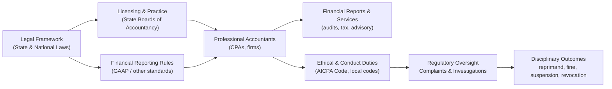

[[concepts/Explainers for Tooling/Back Office|Back Office]]

# Defining and Describing Accounting (Discipline, Regulations)

_Accounting as a regulated discipline is the combination of technical measurement rules, ethical codes, licensing laws, and disciplinary systems that govern how financial information is recorded, reported, and policed._

As a **discipline**, accounting covers the principles and methods used to identify, measure, and communicate financial information for decision‑making and control in organizations. [^6pc6zs] As a **regulated profession**, it operates under statutory frameworks (public accountancy laws), standards such as generally accepted accounting principles (GAAP), codes of professional conduct, and enforcement by state boards and professional bodies. [^9se6bt] [^3a8pgv] [^11qqfp] Regulations matter because they aim to protect investors, creditors, and the public from misleading financial reporting and professional misconduct by requiring competence, integrity, and accountability in the work of accountants. [^9se6bt] [^3a8pgv] [^11qqfp] When accountants breach these duties—through fraud, gross negligence, or failure to follow GAAP—the result can be malpractice claims, regulatory sanctions, or loss of license. [^3a8pgv] [^11qqfp]  

# Uses in Context

- In professional discipline, accounting regulation is invoked through **codes of conduct** that licensed accountants must follow, such as the requirement that *“an accountant shall adhere to the Code of Professional Conduct of the American Institute of Certified Public Accountants”* in state regulations governing public accountancy. [^9se6bt]  
- In malpractice and civil litigation, courts and lawyers frame **accounting malpractice** as occurring when an accountant’s work *“falls below the expected professional standard of care, resulting in financial harm to their client,”* including *“deviations from generally accepted accounting principles and practices.”*[^3a8pgv]  
- In fitness to practice and discipline, state accountancy statutes treat **dishonesty, fraud, or gross negligence in the public practice of accountancy** and *“fraud or deceit in obtaining a certificate as a certified public accountant”* as specific grounds for action against a license. [^11qqfp]  
- In the governance of professional societies, disciplinary rules refer to **impairment of license and automatic discipline**, such as provisions on *“impairment of license to practice public accounting”* and *“automatic discipline”* when a state board sanctions a member. [^x4orzd]  
- In education and accreditation, accounting as a discipline is defined and measured through accreditation standards stating that **competency goals must “clearly define discipline‑specific content appropriate for each degree level”** for accounting programs. [^6pc6zs]  
- In cross‑professional regulation, accounting methods are embedded in other disciplines’ regulations, such as detailed **trust accounting rules** for lawyers that prescribe journals, client ledgers, reconciliations, and record retention periods in bar rules. [^24odgi]  

# History of Use

## Origins

- As a **discipline**, organized accounting practice traces back to late medieval and Renaissance Europe with the codification of double‑entry bookkeeping by practitioners such as Luca Pacioli in the 15th century; modern codification of accounting as a university discipline and professional field was later recognized through specialized accounting programs and professional bodies, which today are governed by accreditation standards that specify accounting as a distinct academic unit with its own *“discipline‑specific content.”*[^6pc6zs]  
- As a **regulated profession**, the modern term “public accountancy” and associated licensing and disciplinary regimes emerge in state statutes such as public accountancy acts, where legislatures define who may hold themselves out as certified public accountants, impose licensing requirements, and authorize boards to discipline for *“fraud or deceit in obtaining a certificate”* or *“dishonesty, fraud or gross negligence in the public practice of accountancy.”*[^9se6bt] [^11qqfp]  

## Evolution

- **Early 20th century – statutory licensing and board oversight**  
  U.S. states and other jurisdictions progressively adopted public accountancy statutes that established licensing for CPAs and state boards of accountancy with authority to regulate practice, supervise adherence to professional standards, and sanction misconduct such as fraud and gross negligence. [^9se6bt] [^11qqfp]  

- **Mid–late 20th century – codified ethical standards and GAAP enforcement**  
  Professional bodies such as the American Institute of Certified Public Accountants adopted formal **Codes of Professional Conduct**, which many state regulations then incorporated by requiring licensed accountants to *“adhere to the Code of Professional Conduct of the American Institute of Certified Public Accountants.”*[^9se6bt] Simultaneously, courts and regulators increasingly grounded malpractice and discipline in compliance with GAAP and other “broadly accepted accounting principles.”[^3a8pgv]  

- **21st century – expanded accountability and educational accreditation**  
  Contemporary regulatory frameworks emphasize detailed disciplinary processes and automatic discipline when licenses are impaired, as reflected in society rules on *“Professional Conduct and Disciplinary Proceedings”* and *“Automatic Discipline.”*[^x4orzd] At the same time, accounting education has been formalized through international accreditation standards that require accounting academic units to demonstrate clear discipline‑specific competencies and continuous assurance of learning, further solidifying accounting’s status as a distinct academic and professional field. [^6pc6zs]  

# Best Real-World Examples

- [Alaska State Board of Public Accountancy](https://www.commerce.alaska.gov/web/portals/5/pub/CPARegulations.pdf) – illustrates a comprehensive regulatory regime, including licensing, practice requirements, and incorporation of the AICPA Code of Professional Conduct into binding regulations. [^9se6bt]  
- [North Carolina State Board of CPA Examiners](https://nccpaboard.gov/resources/north-carolina-general-statute-excerpts/) – exemplifies statutory discipline, listing specific causes such as *“fraud or deceit in obtaining a certificate”* and *“dishonesty, fraud or gross negligence in the public practice of accountancy.”*[^11qqfp]  
- [NYSSCPA Disciplinary Matters](https://www.nysscpa.org/professional-resources/ethics/disciplinary-matters) – shows how a professional society’s ethics and disciplinary system interacts with state regulatory actions, including provisions on impairment of license and automatic discipline. [^x4orzd]  
- [Kingsley Napley – Professional Accountancy Bodies’ Disciplinary Processes FAQ](https://www.kingsleynapley.co.uk/services/department/regulatory/defending-accountants-and-accountancy-firms/professional-accountancy-bodies-disciplinary-processes-faqs) – provides a practitioner‑level description of how complaints, investigations, and sanctions work across several UK accountancy bodies. [^61ulss]  
- [Parker Shaffie LLP – Accounting Malpractice Practice](https://parkershaffiellp.com/accounting-malpractice/) – illustrates how civil courts and litigators operationalize accounting standards and regulations in defining negligence and malpractice claims. [^3a8pgv]  
- [AACSB Accounting Accreditation Standards 2026](https://www.aacsb.edu/-/media/documents/accreditation/2026/2026-accounting-standards.pdf) – demonstrates how accounting is institutionalized as an academic discipline through formal accreditation criteria centered on discipline‑specific competency goals. [^6pc6zs]  
- [Florida Bar Trust Accounting Guidance](https://www.floridabar.org/the-florida-bar-news/yld-webinar-highlights-trust-accounting-pitfalls-and-disciplinary-risks/) – while not regulating accountants directly, this legal framework shows how accounting processes and controls are embedded into another profession’s discipline and disciplinary risks. [^24odgi]  

# Case Studies

### 1. Professional Accountancy Body Disciplinary Process (UK context)

In the UK, professional accountancy bodies such as ACCA, ICAEW, CIMA, CIPFA, ICAS, and AAT operate **formal disciplinary systems** that overlay the statutory regulation of audit and public practice. [^61ulss] According to a practitioner guide, *“members of professional accountancy bodies are expected to comply with the relevant standards of professional conduct and adhere to rules and regulations,”* and **anyone** can submit a complaint to the relevant body so long as the matter falls within its jurisdiction. [^61ulss] Once a complaint is received, a **Case Manager** is appointed who will notify the member, request written responses and documents, and continue this exchange *“until the Case Manager has all of the information they need to make an assessment on whether the matter should proceed to the next step of the disciplinary process.”*[^61ulss]  

If the case proceeds, an independent committee or assessor may dismiss the complaint, order further investigation, place a record on the member’s file, *“offer a sanction,”* or refer the matter for a full disciplinary hearing; available sanctions at this stage often include reprimands and fines, and committees may award costs against the member. [^61ulss] For more serious cases, a **full disciplinary hearing** is held, with notice periods such as 28 days for ICAS, AAT, and ACCA, 35 days for CIMA, and at least 30 days after a case management hearing for ICAEW. [^61ulss] Final sanctions can range from reprimand and severe reprimand to suspension or withdrawal of a practising certificate, suspension from membership, and exclusion from membership, again with potential costs awards. [^61ulss] Members typically have defined rights of appeal, with time limits—for example 14 days for AAT decisions and 21–28 days for other bodies. [^61ulss] This case study shows how accounting regulation is not only statutory but also **self‑regulatory**, with detailed due‑process structures and graduated sanctions to enforce ethical and professional standards.  

### 2. State Public Accountancy Regulation and Discipline (U.S. state example)

U.S. state boards of accountancy implement **public accountancy statutes and regulations** that define the scope of practice, licensing, and disciplinary powers. [^9se6bt] [^11qqfp] In one representative framework, regulations specify that each office practicing public accounting in the state must be under the direct supervision of an individual holding a state‑issued license, reinforcing personal responsibility for professional work. [^9se6bt] Those regulations also mandate that *“an accountant shall adhere to the Code of Professional Conduct of the American Institute of Certified Public Accountants,”* effectively transforming professional ethical standards into legally enforceable obligations. [^9se6bt]  

Complementing these regulations, statutory provisions in a state such as North Carolina enumerate precise grounds for disciplinary action by the board, including *“fraud or deceit in obtaining a certificate as a certified public accountant,”* *“dishonesty, fraud or gross negligence in the public practice of accountancy,”* and other forms of misconduct. [^11qqfp] These provisions empower the board to investigate complaints, hold hearings, and impose sanctions up to and including revocation of the certificate to practice. [^11qqfp] Professional societies then build on these public decisions via **automatic discipline** provisions—if a member’s license is impaired by a state board, the society’s own disciplinary policy may trigger corresponding measures such as suspension or expulsion. [^x4orzd] This case demonstrates how accounting regulation arises from an interlocking system of **state law, delegated board authority, and professional society rules**, collectively shaping the discipline’s boundaries and enforcing its norms.  

### 3. Accounting Malpractice and the Role of Standards and Regulations

In civil litigation, **accounting regulations and standards** provide the benchmark for determining whether an accountant’s conduct constitutes malpractice. [^3a8pgv] Legal practitioners describe accounting malpractice as occurring when *“an accountant commits malpractice when their work on behalf of a client falls below the expected professional standard of care, resulting in financial harm to their client.”*[^3a8pgv] The kinds of failures that support such claims include *“avoidable errors in work performed for a client, omissions, misrepresentations, or deviations from generally accepted accounting principles and practices.”*[^3a8pgv]  

In practice, this means that failure to adhere to GAAP or other accepted standards—especially where those standards have been incorporated by statute or regulation—can be used as evidence that the accountant did not meet the standard of care required of the profession. [^9se6bt] [^3a8pgv] Courts and litigants thus rely on the same frameworks that define accounting as a regulated discipline—GAAP, state regulations, and professional codes—to assess whether a client’s losses stem from negligence or more serious misconduct. [^9se6bt] [^3a8pgv] [^11qqfp] The case study underscores that accounting as a discipline is not only **theoretical or educational** but also deeply embedded in **legal accountability**, where breaches of its rules have direct financial and professional consequences.

***

# Sources

[^61ulss]: [Professional accountancy bodies' disciplinary processes: FAQs](https://www.kingsleynapley.co.uk/services/department/regulatory/defending-accountants-and-accountancy-firms/professional-accountancy-bodies-disciplinary-processes-faqs)
[^9se6bt]: [[PDF] Statutes and Regulations Public Accountancy](https://www.commerce.alaska.gov/web/portals/5/pub/CPARegulations.pdf)
[^3a8pgv]: [Accounting Malpractice Attorney Los Angeles, CA |](https://parkershaffiellp.com/accounting-malpractice/)
[^24odgi]: [YLD webinar highlights trust accounting pitfalls and disciplinary risks](https://www.floridabar.org/the-florida-bar-news/yld-webinar-highlights-trust-accounting-pitfalls-and-disciplinary-risks/)
[^x4orzd]: [Disciplinary Matters - NYSSCPA](https://www.nysscpa.org/professional-resources/ethics/disciplinary-matters)
[^6pc6zs]: [[PDF] 2026 standards for accounting accreditation - aacsb](https://www.aacsb.edu/-/media/documents/accreditation/2026/2026-accounting-standards.pdf?rev=8409e539e87b44ad91765daef6f4772b&hash=DC7AB9D9ABB0FE4AFD0099931E06D631)
[7]: [[PDF] School Attendance and Student Accounting Manual - NC DPI](https://www.dpi.nc.gov/documents/fbs/resources/sasa/open)
[^11qqfp]: [North Carolina General Statute Excerpts](https://nccpaboard.gov/resources/north-carolina-general-statute-excerpts/)
[9]: [Massachusetts Rethinking Discipline Initiative](https://www.doe.mass.edu/sfs/discipline/)
