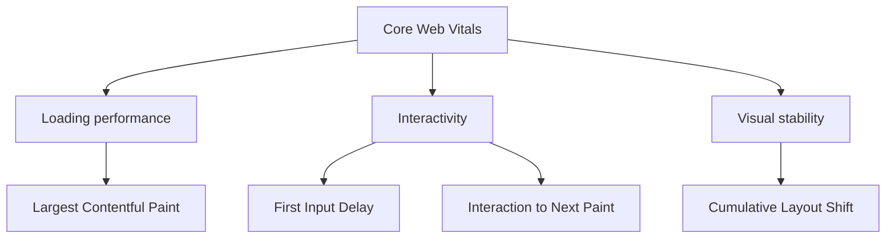

[[concepts/Explainers for Tooling/Web Analytics|Web Analytics]]
[[Vocabulary/User Experience|User Experience]]
[[concepts/Market-Categories/Customer Experience|Customer Experience]]
[[Vocabulary/Digital Experience|Digital Experience]]

# Defining and Describing Core Web Vitals

- *Core Web Vitals are Google’s shorthand for whether a page feels fast, stable, and responsive to real people.* [^3u6q1b] [^t9mvm9] [^hx6if4]
- Core Web Vitals are a set of high-level metrics designed by Google to capture user experience on the web, with a focus on loading performance, interactivity, and visual stability. [^3u6q1b] [^t9mvm9]
- The standard set originally consisted of 
1. **Largest Contentful Paint (LCP)**, 
2. **First Input Delay (FID)**, and 
3. **Cumulative Layout Shift (CLS)**, and later guidance and tooling also include 
4. **Interaction to Next Paint (INP)** as the newer interactivity metric. [^3u6q1b] [^t9mvm9] [^hx6if4] [^9mvgf3]

- 

## Uses in Context

- In analytics dashboards, Core Web Vitals are used to “pinpoint which elements in a web page are affecting the user's experience” in visual form. [^3u6q1b]
- In optimization guides, they are described as metrics that help improve “loading performance, interactivity, and visual stability” to retain users and drive conversions. [^t9mvm9]
- In performance monitoring, they are treated as real-user signals that summarize how visitors experience page speed and responsiveness rather than just lab-test results. [^3u6q1b] [^206cjl]
- In web development workflows, they are used as a baseline for prioritizing fixes such as image optimization, script deferral, CSS cleanup, and layout-stability improvements. [^9mvgf3] [^32opo1]
- In enterprise accessibility and performance programs, Core Web Vitals are combined with WCAG checks to manage both UX and compliance risk in one system. [^32opo1]

## History of Use

### Origins

- The term is associated with Google’s Web Vitals initiative, which Addy Osmani says was officially launched in **May 2020** as “a new program… to provide unified guidance for quality signals that are essential to delivering a great user experience on the web.” [^hx6if4]
- Osmani’s history places the work inside Google beginning in **2014**, with Core Web Vitals emerging as “the first and most important” metrics in that initiative. [^hx6if4]
- The initial core set was a shortlist of metrics focused on “the core aspects of user experience that apply to all web pages.” [^hx6if4]

### Evolution

- **2014–2020:** The concept matured from internal performance research into a standardized web-quality program at Google, culminating in the Web Vitals launch and the Core Web Vitals shortlist. [^hx6if4]
- **2020:** Core Web Vitals were defined around three metrics: LCP for loading, FID for interactivity, and CLS for visual stability. [^t9mvm9] [^hx6if4]
- **Later guidance:** INP replaced FID as the interactivity metric in newer explanations and tooling, reflecting a shift from first-input latency to broader responsiveness across the visit. [^3u6q1b] [^t9mvm9] [^9mvgf3]

## Best Real-World Examples

- [Cloudflare Web Analytics](https://developers.cloudflare.com/web-analytics/data-metrics/core-web-vitals/) — surfaces Core Web Vitals visually so site owners can identify page elements affecting experience. [^3u6q1b]
- [Google PageSpeed Insights](https://business.adobe.com/blog/basics/web-vitals-explained) — commonly used to inspect LCP, INP, and CLS performance on pages. [^t9mvm9]
- [Google Search Console](https://www.interactmarketing.com/why-core-web-vitals-still-matter-more-than-you-think-in-2026/) — used for ongoing Core Web Vitals monitoring with real Chrome user data. [^9mvgf3]
- [Google Lighthouse](https://www.siteimprove.com/blog/core-web-vitals-wcag/) — used in build and audit workflows to test Core Web Vitals alongside accessibility. [^32opo1]
- [WP Rocket](https://docs.wp-rocket.me/article/1858-core-web-vitals-assessment) — exposes assessments based on the experience real visitors had in the last 28 days. [^206cjl]
- [Google Analytics](https://www.siteimprove.com/blog/core-web-vitals-wcag/) — used in RUM setups to capture field data across devices and regions. [^32opo1]
- [Boomerang](https://www.siteimprove.com/blog/core-web-vitals-wcag/) — used as a real-user monitoring tool for Core Web Vitals. [^32opo1]

## Case Studies

A practical example of Core Web Vitals in use is Cloudflare Web Analytics, which presents the metrics as a visual diagnostic tool that helps pinpoint page elements hurting experience. [^3u6q1b] Its documentation frames Core Web Vitals as “high-level metrics designed by Google,” and it lists the three classic measures—LCP, FID, and CLS—along with ratings such as Good, Needs Improvement, or Poor. [^3u6q1b] This shows how the concept moved from abstract performance theory into operational dashboards that let teams inspect page components and prioritize fixes. [^3u6q1b]

Another example is the optimization workflow described by Adobe, which treats Core Web Vitals as standardized measures of loading, interactivity, and stability and explicitly says they were “Introduced in 2020.” [^t9mvm9] In that framing, LCP, INP, and CLS become the working triad for improving user experience and conversion outcomes, which reflects how the concept expanded from measurement into business optimization practice. [^t9mvm9]

A third example is the enterprise approach described by Siteimprove, which recommends combining Core Web Vitals with WCAG checks and integrating both into the same build-and-backlog process. [^32opo1] The article says tools such as Google Lighthouse can test both accessibility and Core Web Vitals for every deployment, while RUM tools capture real-world data across devices and regions. [^32opo1] That case shows Core Web Vitals functioning not as a standalone metric set, but as part of a broader product-quality system that connects engineering, UX, and governance. [^32opo1]

***

# Sources

[^3u6q1b]: [Core Web Vitals · Cloudflare Web Analytics docs](https://developers.cloudflare.com/web-analytics/data-metrics/core-web-vitals/)
[^t9mvm9]: [Core Web Vitals — What they are and how to optimize them](https://business.adobe.com/blog/basics/web-vitals-explained)
[^hx6if4]: [The History of Core Web Vitals - Addy Osmani](https://addyosmani.com/blog/core-web-vitals/)
[^9mvgf3]: [Why Core Web Vitals Still Matter More Than You Think in 2026](https://www.interactmarketing.com/why-core-web-vitals-still-matter-more-than-you-think-in-2026/)
[^32opo1]: [Core Web Vitals and WCAG: One Operating System for Enterprise ...](https://www.siteimprove.com/blog/core-web-vitals-wcag/)
[6]: [What are Core Web Vitals & How to Improve Them? Complete Guide](https://www.simpalm.com/blog/what-are-core-web-vitals)
[^206cjl]: [Core Web Vitals Assessment - WP Rocket Knowledge Base](https://docs.wp-rocket.me/article/1858-core-web-vitals-assessment)
[8]: [Improve Core Web Vitals on Your WordPress Site - BigScoots](https://www.bigscoots.com/blog/core-web-vitals-wordpress/)
