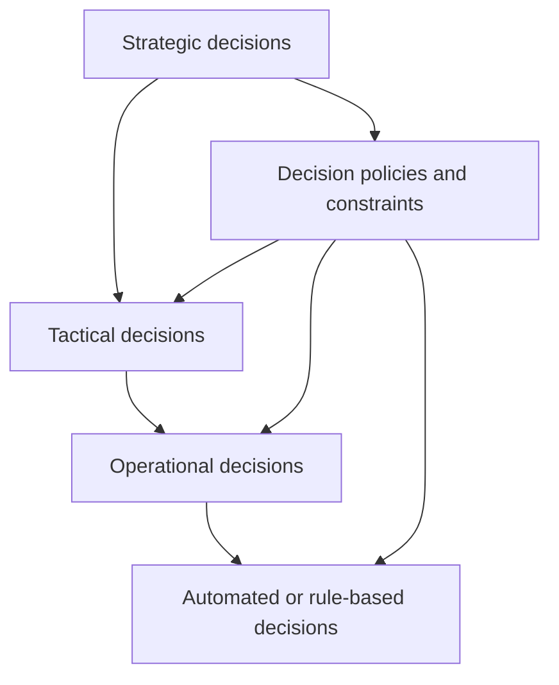

[[Vocabulary/Decision Science|Decision Science]]
[[concepts/CARBS/Decision Trees|Decision Trees]]
[[Vocabulary/Decision Quality Framework|Decision Quality Framework]]

# Defining and Describing Decision Hierarchies

_“Decision hierarchies” are the layered structures that determine who gets to decide what, at which level, and based on which inputs._

In practice, **decision hierarchies** describe how decision rights, information, and authority are arranged from high‑level strategic choices down to operational or automated micro‑decisions.[2][3] They show how decisions “roll up” and “drill down” between levels, much like data hierarchies in analytics or entity hierarchies in organizations.[2][3][9] This matters because complex organizations, software systems, and analytics stacks rely on clear hierarchies to ensure consistent, explainable decisions and to avoid conflicts where multiple actors try to decide the same thing at different levels.[2][3][9]

## Uses in Context

- In **finance and FP&A**, hierarchy management tools describe how financial entities, accounts, and cost centers are structured so that data “rolls up” for reporting and decision‑making, providing a structural foundation that “supports better decision-making” across the organization.[2]  
- In **[[Vocabulary/Business Intelligence|Business Intelligence]] and [[Vocabulary/OLAP (Online Analytical Processing)]]**, attribute hierarchies (e.g., Year → Quarter → Month → Day) are explicitly defined so users can “drill down or roll up through data, making reports easier to explore and understand,” which directly shapes how decision makers navigate from high‑level metrics to granular drivers.[3]  
- In **organizational design and [[Vocabulary/Enterprise Resource Planning|ERP]] systems**, multiple organizational hierarchies are created to represent different views (legal, operational, reporting) so leaders at each level can make decisions aligned with strategy; for example, Dynamics 365 lets you “set up multiple organizational hierarchies to represent different views of your business.”[9]  
- In **governance, risk, and compliance (GRC)** tools, entity hierarchies are configured so that risk and control decisions can be assessed and escalated by level (entity, business unit, group), as discussed in ServiceNow community guidance on “how to set up entity hierarchy” for GRC.[5]  
- In **sales and revenue operations**, account hierarchies (mapping parent–subsidiary relationships) are used so sales and success teams can decide on coverage, pricing, and renewal strategy at the correct corporate level; an account hierarchy is described as “a structured map of the parent-child relationships between legal entities within a corporate group.”[10]  
- In **data modeling**, entity–relationship models capture how entities relate so that higher‑level conceptual decisions (e.g., which entities exist and how they connect) constrain lower‑level implementation decisions in databases and applications.[8]  

# History of Use

## Origins

- The **underlying idea** of layered decision structures appears in classic organization theory and management science, where hierarchies of authority and decision rights were analyzed long before the specific phrase “decision hierarchy” saw common use.[2][9]  
- In information systems and analytics, the conceptual pattern was formalized through **hierarchies in multidimensional data models**: attribute hierarchies in OLAP cubes were defined to organize data “into levels, showing how they roll up from detailed to summarized data,” enabling structured decision analysis.[3]  
- In corporate and financial contexts, hierarchy management emerged as a formal discipline describing how legal entities, accounts, and reporting relationships are organized into multi-level frameworks “for reporting and decision-making,” effectively codifying decision levels around financial information.[2]  

*(Public web sources clearly document the practice of hierarchy management for decision‑making, but do not pinpoint a single canonical coining of the exact phrase “decision hierarchies”; it is best understood as a convergence of these earlier strands.)*

## Evolution

- **1990s–2000s – OLAP and multidimensional modeling:** As OLAP became mainstream, formal **attribute hierarchies** (time, geography, product) gave analysts structured ways to move between decision levels, from summary KPIs down to transaction detail.[3]  
- **2000s–2010s – Enterprise hierarchy management:** Growing corporate complexity led to dedicated hierarchy management in finance, where multi‑level frameworks of entities and accounts were described as enabling “aggregation, analysis, and control” for decision‑making across business units and geographies.[2]  
- **2010s–2020s – Integrated organizational and data views:** Modern ERP and cloud platforms such as Dynamics 365 emphasized planning “organizational hierarchies” to support different decision views (legal, operational, managerial), blurring the line between organizational charts and decision structures.[9]  

# Best Real-World Examples

- [Dynamics 365 organizational hierarchies](https://learn.microsoft.com/en-us/dynamics365/fin-ops-core/fin-ops/organization-administration/plan-organizational-hierarchy) – lets companies design multiple organizational hierarchies so each view supports specific planning and decision processes (legal, operational, reporting).[9]  
- [Hyperbots hierarchy management](https://www.hyperbots.com/glossary/hierarchy-management-finance) – explains hierarchy management in finance as organizing entities, accounts, and reporting relationships into multi-level frameworks that “support better decision-making.”[2]  
- [OWOX BI attribute hierarchies](https://www.owox.com/glossary/attribute-hierarchy) – illustrates how attribute hierarchies (e.g., Year → Quarter → Month → Day) structure the way decision makers explore data in BI tools.[3]  
- [LeanData account hierarchies](https://www.leandata.com/blog/account-hierarchies-for-b2b-teams/) – uses account hierarchies to route, assign, and prioritize opportunities, ensuring sales decisions respect complex corporate structures.[10]  
- [Clay corporate hierarchy enrichment](https://university.clay.com/lessons/mapping-company-relationships-and-ownership) – maps group HQs, subsidiaries, and decision‑makers to help teams understand “decision-makers at each entity” in a corporate hierarchy.[1]  
- [SNOMED CT observable entity hierarchy](https://docs.snomed.org/implementation-guides/cancer-synoptic-reporting-implementation-guide/3-snomed-ct-content/3.2-observable-entityobservation-pairs-versus-clinical-findings) – uses an observable entity hierarchy instead of clinical findings to structure how clinical observations are modeled and interpreted, affecting diagnostic decision flows.[7]  

# Case Studies

## 1. Financial Hierarchy Management for Better Decisions

A mid‑sized multinational adopting formal **hierarchy management** in finance is a clear example of decision hierarchies in action.[2] According to Hyperbots, hierarchy management “refers to the structured organization of financial data, entities, accounts, and reporting relationships into multi-level frameworks.”[2] In practice, this means grouping legal entities, cost centers, and products into parent‑child structures so finance teams can “aggregate, analyze, and control financial information across business units, geographies, and reporting lines with clarity and consistency.”[2]  

By implementing these hierarchies, the firm can consistently roll up performance from local business units to regional and global views, enabling executives to compare units and make resource‑allocation decisions using the same structural logic everywhere.[2] The hierarchies “provide the structural foundation for organizing financial data across entities, accounts, and operations,” and by enabling accurate aggregation and analysis, they “support better decision-making, enhance transparency, and strengthen overall financial performance in complex organizations.”[2] This case illustrates how explicit financial decision hierarchies reduce ambiguity about which level owns which financial decision and how local data feeds global choices.  

## 2. Attribute Hierarchies Guiding Analytical Decisions

A data‑driven retailer using OLAP cubes and BI dashboards relies heavily on **attribute hierarchies** to structure its decision processes.[3] OWOX describes an attribute hierarchy as organizing related attributes “into levels, showing how they roll up from detailed to summarized data,” with typical patterns like “Year → Quarter → Month → Day.”[3] Analysts and managers navigate these hierarchies to move from high‑level decisions (e.g., annual revenue targets) down to operational questions (e.g., which days or campaigns underperformed).  

Because attribute hierarchies “allow users to drill down or roll up through data, making reports easier to explore and understand without writing complex queries,” they effectively encode a decision hierarchy: which questions are addressed at which level of granularity.[3] The retailer’s BI environment depends on this structure so that executives start at an overview (Year, Region), while category managers and store managers move into Month or Day and specific product attributes as needed.[3] As OWOX notes, such hierarchies are “important because they provide order and consistency to data models, enabling users to explore trusted data in a structured and meaningful manner,” directly shaping how decisions are framed and escalated in the organization.[3]  

## 3. Organizational Hierarchies Aligning Strategy and Operations

An enterprise deploying **Dynamics 365** to formalize its organizational structure shows how organizational hierarchies become decision hierarchies.[9] Microsoft’s documentation explains that you can “set up multiple organizational hierarchies to represent different views of your business,” such as legal entities, operating units, or reporting structures.[9] These hierarchies are linked to financial dimensions so that you can “create reports based” on them; in effect, the chosen hierarchy defines who sees what and who decides what at each level.[9]  

By designing distinct hierarchies for legal [[concepts/Explainers for AI/Compliance AI|Compliance AI]], operational management, and internal reporting, the organization clarifies which decisions (e.g., regulatory, operational, financial) belong to which level and line of reporting.[9] Leaders can re‑organize or add levels to reflect changes in strategy or governance, with the hierarchy directly influencing how budgets, approvals, and performance decisions are made and rolled up.[9] This case highlights how an explicit organizational hierarchy inside an ERP system operationalizes a decision hierarchy, ensuring that strategic intent can be traced through to detailed operational decisions via consistent structural relationships.

***

# Sources

[1]: [Mapping Company Relationships and Ownership - Clay University](https://university.clay.com/lessons/mapping-company-relationships-and-ownership)
[2]: [What is hierarchy management finance? - Hyperbots](https://www.hyperbots.com/glossary/hierarchy-management-finance)
[3]: [Attribute Hierarchy — Definition, Types & Examples - OWOX](https://www.owox.com/glossary/attribute-hierarchy)
[4]: [Hierarchies - Flecs](https://www.flecs.dev/flecs/md_docs_2HierarchiesManual.html)
[5]: [How to Set up entity hierarchy - ServiceNow Community](https://www.servicenow.com/community/grc-forum/how-to-set-up-entity-hierarchy/td-p/3298543)
[6]: [What is an entity structure? Tips to choose the right one - Diligent](https://www.diligent.com/resources/blog/business-entity-structure)
[7]: [Observable Entity/Observation Pairs versus Clinical Findings](https://docs.snomed.org/implementation-guides/cancer-synoptic-reporting-implementation-guide/3-snomed-ct-content/3.2-observable-entityobservation-pairs-versus-clinical-findings)
[8]: [Entity–relationship model - Wikipedia](https://en.wikipedia.org/wiki/Entity%E2%80%93relationship_model)
[9]: [Plan your organizational hierarchy - Dynamics 365 - Microsoft Learn](https://learn.microsoft.com/en-us/dynamics365/fin-ops-core/fin-ops/organization-administration/plan-organizational-hierarchy)
[10]: [Account Hierarchies for B2B Teams - LeanData](https://www.leandata.com/blog/account-hierarchies-for-b2b-teams/)
