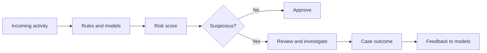

[[Payment Systems]]
[[lost-in-public/market-maps/Agentic AI in Fintech|Agentic AI in Fintech]]
[[Revenue Operations|RevOps]]

_**Fraud detection** is the practice of spotting suspicious behavior, transactions, or identities before they become losses._ It is used wherever organizations need to distinguish legitimate activity from deception, especially in payments, banking, insurance, lending, and account security. [^d5x7gl] [^bg4tn7] [^yr2455] Modern fraud detection often combines rules, machine learning, behavioral analytics, and entity resolution to reduce false positives and surface hidden links across records. [^j8r105] [^rio412] [^l5e4gs] [^5www4d]

# Defining and Describing Fraud Detection

## Uses in Context

- In financial services, fraud detection is invoked to monitor payments, account access, and onboarding for signs of fraud, with AI used to identify fraudulent activity in real time. [^bg4tn7] [^yr2455] [^5www4d]
- In fraud analytics, vendors describe detection as the combination of behavioral profiles, transaction profiles, and entity-level signals across consumers, merchants, and devices. [^rio412]
- In financial-crime investigations, entity resolution is used alongside fraud detection to unify records that refer to the same person or organization and reduce false positives. [^j8r105]
- In product and platform marketing, fraud detection is often framed as a way to “prevent fraud,” “reduce costly false positives,” and “reach real-time risk assessments.”[^bg4tn7] [^5www4d]
- In software tool roundups, fraud detection is treated as an operational category that covers payment fraud, synthetic identities, and account takeover. [^d5x7gl]

## History of Use

### Origins

Fraud detection emerged first as a practical fraud-control function in finance and payments, then expanded as data analytics and machine learning made it possible to detect patterns at scale. [^rio412] [^yr2455] [^5www4d] Contemporary vendor definitions emphasize that it now spans not just transactions but also behavioral and entity-level signals, reflecting a shift from simple rule checks to multi-signal risk scoring. [^rio412] [^l5e4gs] [^5www4d]

### Evolution

- By the time fraud analytics products emphasized behavioral profiles, detection had broadened from transaction monitoring to tracking each entity’s financial and non-financial activity. [^rio412]
- As AI systems became common in banking and financial services, vendors described fraud detection as capable of analyzing transaction data and identifying fraudulent activity in real time. [^bg4tn7] [^yr2455] [^5www4d]
- More recent financial-crime tooling added entity resolution, because combining fragmented records into a single customer view improves accuracy and reduces false positives in investigations. [^j8r105]

## Best Real-World Examples

- [Feedzai](https://www.feedzai.com/blog/what-is-ai-fraud-detection/) — positions AI fraud detection as a way to uncover more fraud accurately and reduce false positives. [^5www4d]
- [FICO](https://www.fico.com/blogs/what-are-fraud-analytics-and-how-do-they-improve-fraud-detection) — describes fraud analytics using behavioral and transaction profiles to improve fraud detection. [^rio412]
- [Alloy](https://www.alloy.com/blog/5-ways-ai-fraud-detection-helps-financial-orgs) — frames AI fraud detection as supporting document verification and real-time attack monitoring. [^bg4tn7]
- [Socure](https://www.socure.com/fraud-prevention-solutions) — [[Socure]] — emphasizes digital intelligence and behavioral analytics in fraud prevention. [^l5e4gs]
- [Emburse](https://www.emburse.com/resources/ai-fraud-detection-in-banking) — presents machine-learning fraud detection for banking as real-time analysis of transaction data. [^yr2455]
- [Lucinity](https://lucinity.com/blog/the-role-of-entity-resolution-in-fincrime-investigations-from-fuzzy-matches-to-precise-risk-signals) — highlights entity resolution as a way to improve detection accuracy and reduce false positives. [^j8r105]
- [ShadowDragon](https://shadowdragon.io/resources/best-fraud-detection-software-tools/) — catalogs fraud detection software for payment fraud, synthetic IDs, and account takeover. [^d5x7gl]

## Case Studies

A useful example is the move from isolated transaction checks to entity-resolution-assisted investigation in financial crime teams. Lucinity describes entity resolution as identifying and combining records for the same person or organization across disparate databases and formats, which creates a “single, accurate customer view” and helps investigators “reduce false positives.”[^j8r105] This shows that fraud detection is no longer just about flagging anomalies; it is also about reconstructing identity across messy data so the right person is investigated. [^j8r105]

Another case is the AI-driven fraud detection messaging used by banking and fintech vendors. Emburse says AI fraud detection in banking uses machine learning models to analyze transaction data and identify fraudulent activity in real time, while Feedzai says AI helps organizations “uncover more fraud accurately” and “reach real-time risk assessments.”[^yr2455] [^5www4d] Together, these sources illustrate a shift from delayed, rules-heavy review to continuous scoring and faster decisioning, especially in high-volume payment environments. [^yr2455] [^5www4d]

FICO’s fraud analytics framing shows how the concept broadened beyond simple blacklists or rules engines. It describes behavioral profiles that track each entity’s financial and non-financial activity and transaction profiles that help improve fraud detection. [^rio412] That matters because it reflects the modern understanding of fraud detection as pattern recognition across many signals, not just a single suspicious transaction. [^rio412]

***

# Sources

[^j8r105]: [Entity Resolution in FinCrime Investigations - Lucinity](https://lucinity.com/blog/the-role-of-entity-resolution-in-fincrime-investigations-from-fuzzy-matches-to-precise-risk-signals)
[^d5x7gl]: [21 Best Fraud Detection Software Tools (2026 Guide)](https://shadowdragon.io/resources/best-fraud-detection-software-tools/)
[^rio412]: [What Are Fraud Analytics and How Do They Improve Fraud Detection?](https://www.fico.com/blogs/what-are-fraud-analytics-and-how-do-they-improve-fraud-detection)
[^bg4tn7]: [5 ways AI actually prevents fraud in financial services - Alloy](https://www.alloy.com/blog/5-ways-ai-fraud-detection-helps-financial-orgs)
[^l5e4gs]: [Fraud Prevention and Risk Solutions | Socure](https://www.socure.com/fraud-prevention-solutions)
[^yr2455]: [AI Fraud Detection in Banking 2026 Guide - Emburse](https://www.emburse.com/resources/ai-fraud-detection-in-banking)
[^5www4d]: [AI for Fraud Detection: How It Works & Why It Matters - Feedzai](https://www.feedzai.com/blog/what-is-ai-fraud-detection/)
[8]: [Fraud Risk Management | Moody's data & analytics solutions](https://www.moodys.com/web/en/us/kyc/solutions/fraud-prevention.html)
