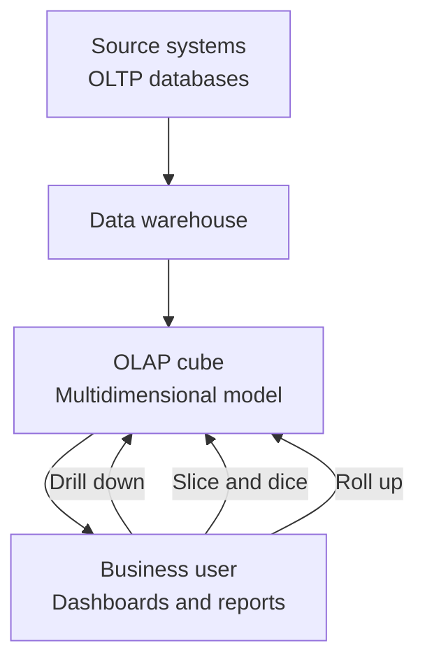

# Defining and Describing OLAP (Online Analytical Processing)

_OLAP is the family of technologies that turn large, multidimensional data sets into fast, interactive analysis for decision‑makers._

Online Analytical Processing (**OLAP**) refers to a set of software technologies and databases optimized to answer complex, multidimensional analytical queries—typically on large volumes of historical data, as opposed to day‑to‑day transactions. [^0gr9ih] [^0f4p1a] [^4myzak] [^3kpzlp] OLAP organizes data into **multidimensional models** (often called *cubes* or hypercubes) so users can explore measures like sales or profit across dimensions such as time, product, and region from many perspectives. [^0f4p1a] [^k8857l] [^e27ykn] It is a core component of **data warehousing** and **business intelligence (BI)**, supporting activities like trend analysis, budgeting, forecasting, and performance management in domains such as finance, marketing, supply chain, and operations. [^0f4p1a] [^e27ykn] Modern OLAP spans classic cube servers and columnar/analytic databases, but the key idea remains: fast, interactive aggregation and slicing of large datasets for better decisions. [^k8857l] [^4myzak] [^3kpzlp]

Key characteristics:

- **Multidimensional model:** OLAP data is represented as cubes/hypercubes with **dimensions** (e.g., Time, Product, Location) and **measures** (e.g., Sales, Profit). [^0f4p1a]  
- **Analytical focus:** OLAP is designed for complex queries, aggregations, and trend analysis rather than transaction processing. [^0gr9ih] [^4myzak] [^3kpzlp]  
- **Interactive performance:** Systems are optimized to answer aggregate queries over large data sets—often “in sub‑second or second‑level latency” for many use cases. [^3kpzlp] [^4myzak]  
- **Typical operations:** Classic OLAP operations include **roll‑up**, **drill‑down**, **slice**, **dice**, and **pivot**, which let users view data at different levels of detail and across different dimension combinations. [^0ihkpx] [^0f4p1a]  

---

# Uses in Context

- In **business intelligence and reporting**, OLAP is described as “a set of software tools used for data analysis in order to make business decisions,” often backing dashboards that track KPIs across time, geography, and product lines. [^0gr9ih] [^e27ykn]  
- In **data warehousing**, OLAP is framed as the technology that “enables organizations to analyze large volumes of business data from multiple perspectives,” sitting on top of a warehouse to support executives and analysts. [^e27ykn]  
- In **multidimensional modeling discussions**, OLAP is invoked as the approach that “organizes business data into multidimensional views so teams can explore metrics across time, product, customer and region.”[^k8857l]  
- In **architectural comparisons**, OLAP is contrasted with OLTP as the class of systems that “answer questions about your data by scanning and aggregating large volumes of historical records,” while OLTP handles frequent row‑level updates. [^4myzak] [^3kpzlp] [^39dz2z]  
- In **tool selection and performance engineering**, vendors describe an “OLAP database” as one “specifically designed for fast, complex analysis of large volumes of historical data,” emphasizing columnar storage, compression, and vectorized execution. [^4myzak] [^66c0du]  

---

# History of Use

## Origins

- The term **OLAP** was coined and popularized by database researcher **Edgar F. (E.F.) Codd** in the early 1990s, in a series of white papers for Arbor Software (later part of Hyperion). [^3kpzlp] Codd introduced “Online Analytical Processing” in contrast to “Online Transaction Processing (OLTP),” proposing it as a category of systems optimized for interactive analysis rather than transaction recording. [^3kpzlp] [^39dz2z]  
- Codd’s work built on earlier multidimensional modeling and decision support ideas from the 1970s–1980s, but his OLAP papers systematized the concept and defined a set of features (often referred to as the “12 rules of OLAP”) that analytic systems should satisfy. [^3kpzlp]  

## Evolution

- **1990s – Proprietary cube servers and classic OLAP:** Commercial products such as Arbor Essbase and other multidimensional engines implemented the OLAP model using dedicated “cube” servers, pre‑aggregating data into multidimensional structures to provide fast consolidation, drill‑down, and slice‑and‑dice operations for business users. [^0ihkpx] [^e27ykn] [^3kpzlp]  
- **2000s – Integration with enterprise data warehousing and BI suites:** As relational data warehouses matured, **ROLAP** (Relational OLAP) and **HOLAP** (Hybrid OLAP) architectures emerged, storing OLAP data in relational tables while providing multidimensional views, and many BI platforms integrated OLAP servers as part of broader reporting and dashboarding stacks. [^0gr9ih] [^e27ykn]  
- **2010s–2020s – “Modern OLAP” on columnar/analytic databases:** New analytic databases and cloud data warehouses (e.g., column‑store engines and MPP systems) adopted OLAP‑style workloads, with vendors describing their systems as OLAP databases “optimized for analyzing large volumes of historical data using complex queries,” often blurring the line between classic cube OLAP and general‑purpose analytical SQL engines. [^k8857l] [^4myzak] [^3kpzlp] [^66c0du]  

---

# Best Real-World Examples

- [ClickHouse](https://clickhouse.com) – [[Tooling/Software Development/Databases/Clickhouse|Clickhouse]] – An open‑source column‑oriented database that presents itself as a high‑performance OLAP engine for “answering multi‑dimensional analytical queries on large datasets, often in sub‑second” time. [^3kpzlp]  
- [Apache Druid](https://druid.apache.org) – A distributed, open‑source OLAP data store designed for “fast slice‑and‑dice analytics” on event and time‑series data, commonly used for real‑time dashboards. (Modern OLAP engines discussion: Druid is frequently cited as an OLAP database. [^4myzak])  
- [MotherDuck](https://motherduck.com) – A startup offering a cloud analytics platform built on DuckDB, described as enabling OLAP‑style analytical workloads (complex aggregations and interactive exploration) without heavy data‑warehouse infrastructure. [^4myzak]  
- [VeloxDB / VELODB](https://www.velodb.io) – A newer OLAP‑focused database that defines itself as an “OLAP database (Online Analytical Processing database)… optimized for analyzing large volumes of historical data using complex queries.”[^66c0du]  
- [InetSoft Style Intelligence](https://www.inetsoft.com) – A BI platform that includes “online OLAP” capabilities for web‑based multidimensional analysis, highlighting consolidation, drill‑down, and slice‑and‑dice as core OLAP techniques. [^0ihkpx]  
- [Databricks SQL](https://www.databricks.com) – [[Tooling/Data Utilities/DataBricks|DataBricks]] – A cloud analytics service that describes OLAP as organizing “business data into multidimensional views so teams can explore metrics across time, product, customer and region,” and positions its Lakehouse architecture to support such workloads. [^k8857l]  
- [Itransition’s OLAP data warehousing solutions](https://www.itransition.com) – A consulting and implementation practice that uses OLAP in data warehouses to help organizations “analyze large volumes of business data from multiple perspectives” for reporting and decision‑making. [^e27ykn]  

---

# Case Studies

## Web‑based OLAP for self‑service business users (InetSoft)

InetSoft, an independent BI vendor, developed **“online OLAP”** as a web‑based approach to analytical processing, allowing multiple users to perform multidimensional analysis through a browser without installing desktop cube clients. [^0ihkpx] Their platform emphasizes three OLAP techniques: **consolidation** (aggregating data across dimensions), **drill‑down** (navigating from summary to detail), and **slice and dice** (re‑segmenting data by different dimension members), enabling non‑technical business users to explore marketing, sales, and management data interactively. [^0ihkpx] By exposing OLAP cubes through web interfaces, InetSoft helped move OLAP from specialist IT tools toward broader self‑service analytics, illustrating how OLAP concepts can be delivered via thin clients while preserving multidimensional power. [^0ihkpx]  

## Modern OLAP database design for large‑scale analytics (ClickHouse / OLAP engines)

ClickHouse is an open‑source columnar DBMS explicitly described as an OLAP system that “answers multi‑dimensional analytical queries on large datasets, often in sub‑second to second‑level latency.”[^3kpzlp] Instead of pre‑built cubes, it stores data in compressed, column‑oriented tables and uses vectorized execution and partitioning to support OLAP‑style operations—aggregations, group‑bys, and filtering over billions of rows—for use cases like web analytics, observability, and financial reporting. [^4myzak] [^3kpzlp] This shows how OLAP’s core goal (fast analytical queries across dimensions) can be achieved with modern database internals rather than traditional cube servers, reflecting the evolution of OLAP from specialized multidimensional engines to general analytic data platforms. [^4myzak] [^3kpzlp]  

## OLAP in data warehouse and BI projects (Itransition‑style implementations)

Consultancies such as Itransition implement OLAP as part of data warehousing projects, where data from multiple operational systems is integrated into a warehouse and exposed through OLAP models for analysis. [^e27ykn] In this pattern, OLAP cubes or OLAP‑style semantic layers allow organizations to “analyze large volumes of business data from multiple perspectives,” supporting analytical queries, trend analysis, and decision‑making across departments. [^e27ykn] These projects typically involve designing dimensions (e.g., Time, Product, Customer) and measures (e.g., Sales, Revenue) and then wiring OLAP tools into BI dashboards and reporting layers, demonstrating how OLAP serves as the analytical heart of many enterprise BI architectures. [^0f4p1a] [^e27ykn]  

***

# Sources

[^0ihkpx]: [Online OLAP Defined - InetSoft](https://www.inetsoft.com/info/online_olap_defined/)
[^0gr9ih]: [OLAP Servers - GeeksforGeeks](https://www.geeksforgeeks.org/data-analysis/olap-servers/)
[^0f4p1a]: [OLAP Operations in DBMS - GeeksforGeeks](https://www.geeksforgeeks.org/dbms/olap-operations-in-dbms/)
[^k8857l]: [What is OLAP? - Databricks](https://www.databricks.com/blog/what-is-olap)
[^e27ykn]: [What is OLAP? OLAP in a Data Warehouse - Itransition](https://www.itransition.com/business-intelligence/data-warehousing/olap)
[^4myzak]: [What is an OLAP Database? Concepts, Examples, and Modern Use ...](https://motherduck.com/learn/what-is-OLAP/)
[^3kpzlp]: [What is OLAP? A complete guide to online analytical processing](https://clickhouse.com/resources/engineering/what-is-olap)
[^39dz2z]: [OLTP vs OLAP: key differences, use cases, and architectures](https://www.tinybird.co/blog/oltp-vs-olap)
[^66c0du]: [OLAP Database: Definition, OLAP vs OLTP & Best Tools (2026)](https://www.velodb.io/glossary/olap-database)
